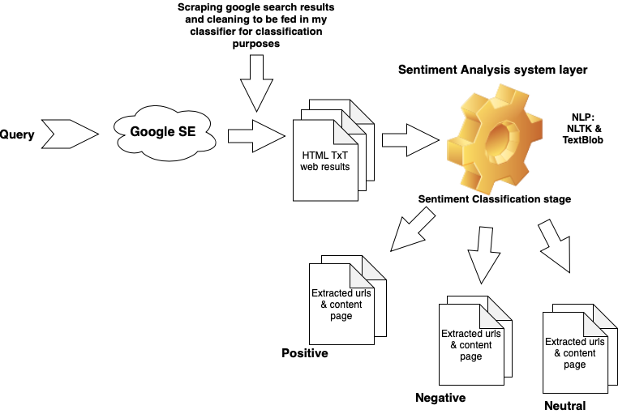
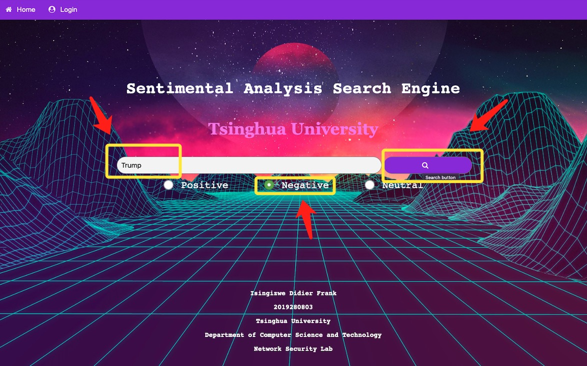
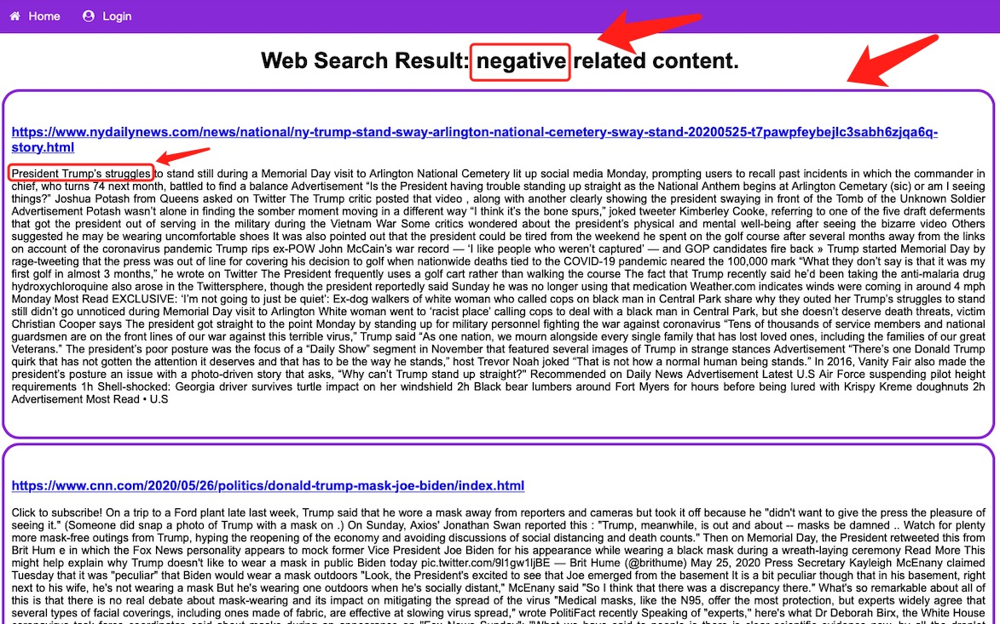

# Sentimental-Analysis-Search-Engine
The search engine that have the ability to classy query results based on the sentimental analysis Developed in Python Django.

Sentiment analysis (Or opinion mining) refers to us as the process of determining the emotional tone behind a series of words, used to gain an understanding of the attitudes, opinions and emotions expressed, while text classification is the process of assigning tags or categories to text according to its content. In this work, i integrated a smart sentiment detector in a search engine that retrieves Positive, Negative Neutral tagged data/results relevant to the query searched with a filter feature that let the user see positive results (good) only, negative results (Bad) only or neutral results (Not bad nor good).

This experiment can be applied to other broad applications such as topic labeling, spam detection, and intent detection. A search engine refers to us as a software system that is designed to carry out web search, which means to search the World Wide Web in a systematic way for particular information specified in a textual web search query. In my experiment, it is just a sentiment anal- ysis oriented search engine which means that the user can choose to see positive (good) or negative (bad) results considering the searched query.

# System Architecture

From the figure below, the query goes to google with the use of API and perform a given query and then search results get cleaned for being feed into my classifier and then the output will depend on which filter the user chose to use depending on what the user wants to see either positive, negative or neutral. 

## Methodology
* You can read more about the method used in the pdf report document for further details.

## Website screenshots
### Website HomeScreen

### After sending a query page

## Project date:

June 7th, 2020

## Author:
Isingizwe Didier Frank
